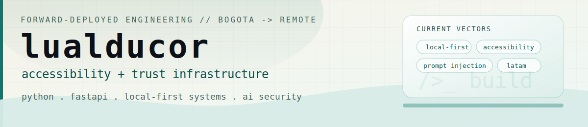

<picture>
  <source media="(prefers-color-scheme: dark)" srcset="banner-dark.svg" />
  
</picture>

 

&nbsp;

&nbsp;

&nbsp;

&nbsp;

---

## about

I build accessibility and trust infrastructure for Spanish-speaking users. Most of my work sits where local-first systems, automation, and AI security meet: Python/FastAPI backends, API integrations, prompt-injection-aware workflows, and products built for LATAM constraints.

---

## current work

| project | status | why it exists |
|---------|--------|---------------|
| [**Boveda**](https://lucholabs.dev/lab#bvd) | in progress | local-first personal finance dashboard for Colombian bank accounts; parses Bancolombia, Nequi, and Daviplata exports into SQLite |
| [**Anti-Phishing Shield**](https://lucholabs.dev/lab#phs) | prototype | plain-language phishing warnings for elderly and non-technical users in Spanish and English |
| [**SUPERFARM**](https://lucholabs.dev/lab#sfm) | research | open agricultural intelligence runtime with shared farm memory, modular specialist agents, and pluggable model routing |
| [**polybar-cyberpunk-hud**](https://github.com/lualducor/polybar-cyberpunk-hud) | open source | dual-monitor Linux HUD with AI spend tracking, Klipper monitoring, and system controls |
| [**lucholabs.dev**](https://lucholabs.dev) | live | portfolio, build log, talks archive, and the canonical source of truth for my current work |

---

## signal

- [Panelist at the AI & Cybersecurity Forum](https://lucholabs.dev/talks/ai-cybersecurity-2026) in Bogota on May 16, 2026, on agent models, emerging threats, and prompt injection attacks.
- [Meritorious thesis publication](https://repositorio.ecci.edu.co/entities/publication/7fd3d03e-a92f-4be0-8b53-f291f6337808) ([context](https://lucholabs.dev/lab#thesis)): open-source live captioning system adopted by SENA Regional Amazonas and Universidad ECCI.
- Open to full-time remote Forward-Deployed Engineer and Solutions Engineer roles at AI-native companies.

---

## stack

---

## github

---

<picture>
  <source media="(prefers-color-scheme: dark)" srcset="https://raw.githubusercontent.com/lualducor/lualducor/output/github-contribution-grid-snake-dark.svg" />
  
</picture>

---

&nbsp;

&nbsp;

&nbsp;

